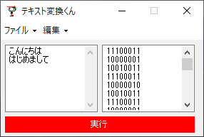

# TextHenKanKun

テキストをビット表現に変換するフリーソフト。

**何ができますか？**

・テキストデータをビットデータに変換します。

・.txtの読み込み、書き出しに対応。

・結果を一行八文字の形式で表示。

**動作環境**

・C#が動作する環境。

・Windows 10及びWindows 11でのみ動作確認を行っています。

**ライセンス**

・ライセンスを表記するほどのソフトではありませんが、改造や二次配布などは常識の範囲内でお願いします。
